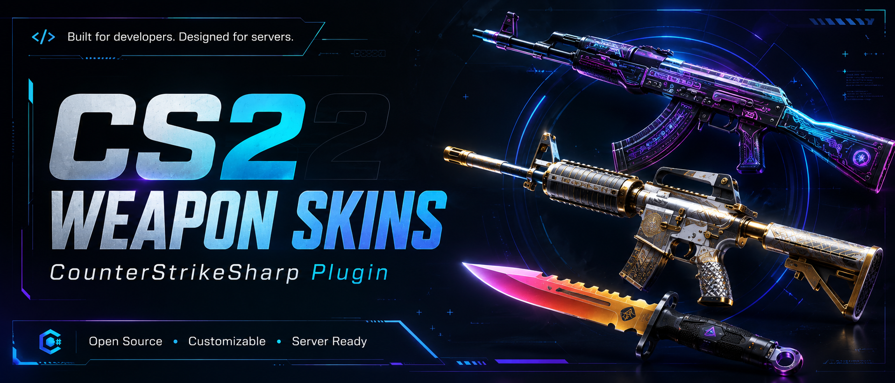

# Astra Skins



Astra Skins is a CounterStrikeSharp plugin for Counter-Strike 2 that provides weapon skins, knives, gloves, and agents through an internal server-side menu and strict database-backed persistence.

## Requirements

- CounterStrikeSharp `1.0.369` or newer runtime build with `.NET 10`.
- MySQL or SQLite, selected explicitly in the plugin config.

## Features

- Internal menu system, no external menu plugin dependency.
- Weapon skins, knife type selection, knife finishes, gloves, and agents.
- Agent radio voice support when the CS2 schema exposes the matching voice data.
- SteamID64-based persistence.
- Strict `mysql` or `sqlite` database mode.
- No automatic database fallback.
- No JSON persistence fallback.
- Runtime cosmetic data loaded from external JSON files.
- Admin reload and diagnostic commands.

## Installation Layout

Copy the plugin files using this layout:

```text
addons/
  counterstrikesharp/
    plugins/
      AstraSkins/
        AstraSkins.dll
        AstraSkins.deps.json
        data/
          weapons.json
          knives.json
          gloves.json
          agents.json
          categories.json
        schema/
          mysql.sql
          sqlite.sql
    gamedata/
      astra_skins.json
    configs/
      plugins/
        AstraSkins/
          AstraSkins.json
```

## Commands

| Command | Description |
| --- | --- |
| `!ws` | Open the weapon/category menu |
| `!knife` | Open the knife menu |
| `!gloves` | Open the gloves menu |
| `!agents` | Open the agents menu |
| `!wsrefresh` | Reapply saved selections |
| `!wsreset` | Reset all saved selections |
| `!wsreset weapons` | Reset only weapon skin selections |
| `!wsreset knife` | Reset only knife type and finish selections |
| `!wsreset gloves` | Reset only glove selections |
| `!wsreset agents` | Reset only agent selections |
| `!wsreload` | Reload JSON definitions, if enabled and permitted |
| `!wsdebug` | Admin diagnostic output, if enabled and permitted |

## Menu Controls

| Key | Action |
| --- | --- |
| `W` | Move up |
| `S` | Move down |
| `E` | Select |
| `Shift` | Back |
| `R` | Close menu |

## Configuration

The default config is safe to publish and uses placeholder database credentials:

```json
{
  "ConfigVersion": 1,
  "DatabaseMode": "mysql",
  "Sqlite": {
    "Path": "data/astra_skins.sqlite"
  },
  "MySql": {
    "Host": "127.0.0.1",
    "Port": 3306,
    "Database": "astra_skins",
    "Username": "astra_skins",
    "Password": "change-me"
  },
  "Menu": {
    "ItemsPerPage": 6,
    "TimeoutSeconds": 25,
    "CooldownMilliseconds": 180,
    "SelectionCooldownMilliseconds": 900
  },
  "Definitions": {
    "Weapons": "data/weapons.json",
    "Knives": "data/knives.json",
    "Gloves": "data/gloves.json",
    "Agents": "data/agents.json",
    "Categories": "data/categories.json"
  },
  "EnableAdminReloadCommand": true,
  "AdminReloadPermission": "@css/config",
  "EnableAdminDebugCommand": true,
  "AdminDebugPermission": "@css/config"
}
```

## SQLite

Set:

```json
{
  "DatabaseMode": "sqlite",
  "Sqlite": {
    "Path": "data/astra_skins.sqlite"
  }
}
```

The SQLite schema is included in `schema/sqlite.sql`. The plugin creates the schema explicitly on startup.

## MySQL

Set:

```json
{
  "DatabaseMode": "mysql",
  "MySql": {
    "Host": "127.0.0.1",
    "Port": 3306,
    "Database": "astra_skins",
    "Username": "astra_skins",
    "Password": "change-me"
  }
}
```

The MySQL schema is included in `schema/mysql.sql`. The configured MySQL database and user must already exist.

## JSON Data

Runtime data files:

```text
data/weapons.json
data/knives.json
data/gloves.json
data/agents.json
data/categories.json
```

Runtime code does not contain skin, knife, glove, agent, paint kit, or weapon skin datasets. It validates these files at startup and on reload. Malformed JSON, duplicate IDs, invalid weapon mappings, missing fields, or broken category references are logged clearly.

Current packaged data contains:

| Type | Count |
| --- | ---: |
| Weapons | 34 |
| Weapon skins | 1415 |
| Knives | 20 |
| Knife skins | 576 |
| Glove types | 8 |
| Glove skins | 94 |
| Agents | 63 |

## Gamedata

Copy:

```text
gamedata/astra_skins.json
```

to:

```text
addons/counterstrikesharp/gamedata/astra_skins.json
```

This file is used only for the internal CS2 econ attribute call needed to apply paint attributes visually.
